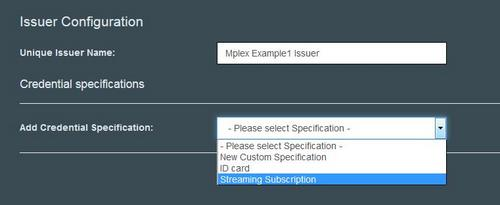
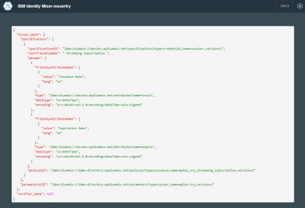
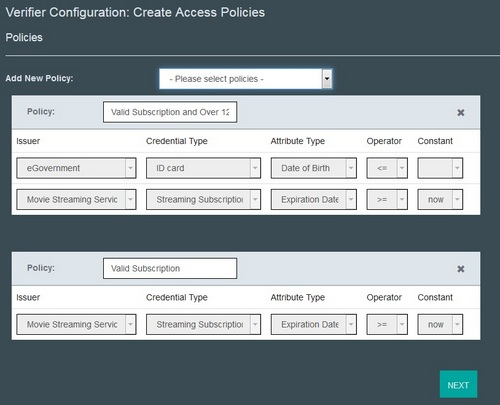
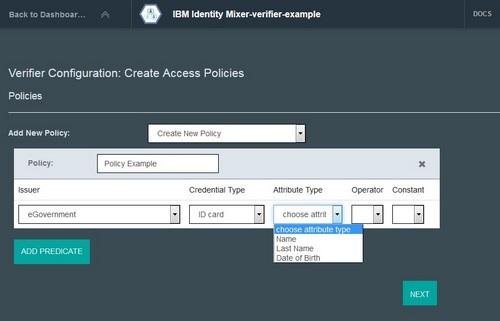

# Getting started with the Identity Mixer sample application

## Introduction

This sample application demonstrates how the IBM Identity Mixer service can enable privacy-preserving authentication for your customers.

Read and follow the instructions provided below. They are intended to help you copy the files in this IBM DevOps Service environment to your own, and assist you to deploy your own IBM Identity Mixer Issuer application to your own IBM Bluemix space.

A running implementation of the sample application is already available at https://mplex1.mybluemix.net/ for testing and demonstration.

This application is an example enable privacy-preserving authentication for your  service's capabilities.

The following instructions explain how to copy the contents of this IBM DevOps Services project to your own IBM DevOps Services project, then build and deploy the sample application to your own Bluemix environment. 
If you are experienced at editing, building, committing and deploying IBM DevOps Services projects to IBM Bluemix, you can likely streamline some of the instruction below.

Before starting, consider a suitable application name and the URL for your IBM Identity Mixer sample client. The name you choose must be unique so that it doesn't clash with other developers' mybluemix.net app names.

Ensure that you have an IBM Bluemix account and the capability to deploy applications to the IBM Bluemix environment.

## I. Create two instances of the IBM Identity Mixer experimental service - one for issuance and one for verification:
1. Login to IBM Bluemix.
1. Click Use Services or APIs.
1. Go to the Bluemix Labs catalog (you have to scroll down to the bottom ob the Bluemix catalog).
1. Click "IBM Identity Mixer" from within the "Security" section of the BluemixLabs catalog:      

1. Configure the Identity Mixer service in the "Add Service" section of the page:    

  1. Select your Node.js application to bind the service to.
  1. Provide a suitable unique name for your Identity Mixer service if you'd prefer something another than the one suggested for you.
  1. The service is provided for free, so there is no plan to select.
  1. Having ensured the TERMS were acceptable to you, click CREATE.
1. Click OK if Bluemix requests to restart your application.

## II. Configure the service

### Acting as Issuer
Step-by-step instructions on how to act as issuer:
1. From the IBM Bluemix Dashboard, locate and click your Bluemix Node.js application to which you bound the Identity Mixer service.
1. Within the Services section of the your application, click its Identity Mixer issuer service. The Identity Mixer Setup Console will be loaded: 

1. Choose the ISSUER role and press START SETUP.
1. Choose a unique name for the Issuer (it must be unique within Bluemix not only your organization):          

1. Add *Credential specification(s)* (a list of the attributes that are contained in a credential) that will be issued by your application by selecting one of the options below:
  1. Select one of the existing specifications that are non-editable:          
          

  1. OR Craft your own credential specification:         

      * Choose a unique name of the Credential Specification
      * Specify a link to the image that will be an icon displayed in the user's credential wallet. You can also use the default image.
      * Add Attributes to you specification by clicking ADD ATTRIBUTE, specifying a Human Readable Name and choosing an appropriate Data Type for each attribute.
1. When you are done, press NEXT.
1. After the Issuer keys are generated (this might take up to 2-3 min because of the key length,but this is only done once) a JSON file with all configuration Information will be displayed:          

1. You can always see this file when selecting the service from the dashboard.

### Acting as Verifier
Preparation: make sure that the access control is in place, i.e. each resource is assigned an access policy. 

Step-by-step instructions on how to act as Verifier:

1. From the IBM Bluemix Dashboard, locate and click your Bluemix Node.js application to which you bound the Identity Mixer service.
1. Within the Services section of the your application, click its Identity Mixer issuer service. The Identity Mixer Setup Console will be loaded: 

1. Choose the VERIFIER role and press START SETUP.
3. Define *presentation policy* (description of what a user has to prove/reveal in order to be granted access to a resource). You can choose more than one policy: 
 1. Select one of the existing policies that are non-editable:          
          

  1. OR Craft your own credential presentation policy by choosing "Create New Policy":         

      * Specify a unique human-readable name of the policy.
      * Define predicates by clicking ADD PREDICATE, choosing the credential issuer, credential type, attribute, operator, and defining a constant:        

1. When you are done, press NEXT.
1. After the presentation policies are generated a JSON file with the information about the policies will be displayed:          

1. You can always see this file when selecting the service from the dashboard.

## III. Fork and redeploy sample application 

Ensure that you have an IBM DevOps Services account and the capability to manage an IBM DevOps Services project.

1. Login to IBM DevOps Services using your IBM DevOps Services account.
1. Click EXPLORE
1. Search for "idemix" (without the quotes).
1. Select the "idemix | verifier" project.
1. To copy the Issuer project to your own new DevOps project:
  1. Click FORK.
  1. Select a suitable name for your new DevOps Services project. Decide whether to make it public or private, or add features for Scrum development.
  1. Check Deploy to Bluemix and select your Bluemix Organization and Bluemix Space. If you are advised that you require a Bluemix account, uncheck the Deploy to Bluemix option.
  1. Click Save. After a short time you should be taken to the project you just created. It should contain a copy of the Identity Mixer Issuer Sample Application resources.
  1. If you were not able to select the Deploy to Bluemix option:
       1. Ensure that you have an IBM Bluemix account and the capability to deploy applications to the IBM Bluemix environment.
       1. Click MY STUFF.
       1. Click the project name you just created.
       1. Click the Settings 'cog' icon (Settings) at the top-right of the page.
       1. Click OPTIONS.
       1. Check the Deploy to Bluemix option. Select the Bluemix Organization and Bluemix Space if possible.
       1. Click SAVE.
       1. Click EDIT CODE.
1. Edit the manifest.yml file. If you are experienced with editing this type of file, edit it as you see fit. Otherwise:
  1. Click manifest.yml to edit its contents.
  1. Change both the host and name parameters from "unique_app_name" to the unique application name (without any quotes) you chose before you started.
  1. Save the manifest.yml file by selecting File>Save from the menu.
1. Edit the configuration files:
  1. Copy the content of the issuer JSON file into "public/js/issue_config.js" file.
  1. Copy the content of the verifier JSON file into "public/js/presentation_config.js" file.
1. Push your changes:
  1. Go to the Git Repository by clicking the 'branch' icon (Git Repository) directly under the editing-pencil on the left of the page.
  1. In the Changed Files section, select the check box to the left of the manifest.yml file to indicate that you want to commit the change you made.
  1. Provide an appropriate Commit message about how you changed the host and name parameters from "unique_app_name" to your unique application name.
  1. Click COMMIT 1 FILES.
  1. On the OUTGOING section under the Commits for the "master" branch, click PUSH to push your changes to the Remote branch.
1. To build and Deploy the Identity Mixer Client sample application:
  1. Click BUILD & DEPLOY.
  1. If requested, click the Deploy to Bluemix link.
  1. Check the Deploy to Bluemix option. Select the Bluemix Organization and Bluemix Space if possible.
  1. Click SAVE.
  1. Click BUILD & DEPLOY.
  1. Click ADVANCED.
  1. Click the "configure builder" button (Settings). This will allow you to configure the packaging of your code.
       1. Select the Ant Builder.
       1. Select the master Branch.
       1. Leave the Build script path blank to use the Ant build.xml in the root folder.
       1. Leave the Build archive directory blank to use the root folder.
       1. Leave the Enable unit tests check box unchecked.
       1. Click SAVE.
  1. Click REQUEST BUILD and verify a green tick appears next to the Build and its version number.
  1. Click "add a stage". This will allow you to push the app instance to IBM Bluemix.
       1. Select IBM Bluemix (https://api.ng.bluemix.net) as the Target URL.
       1. Leave the Application name blank. You should have specified this in the manifest.yml file.
       1. Select the appropriate Bluemix Organization and Bluemix Space if necessary.
       1. Do not change the Script that IBM DevOps Services has provided for you.
       1. Click SAVE.
  1. Drag the build created in step 6 to the "Drop a build to deploy" area.
       1. Wait until a "Deployment Success" message and a green tick are displayed in your deployer area.
       1. You should see that your application has been deployed, and is running.
      

Note:

1. If the application fails to build and/or deploy, review the steps above to remedy the issue.
1. In the future, whenever you commit and push any changes to the code, the application should redeploy automatically to Bluemix. Click BUILD & DEPLOY to verify the deployment status, and to locate the link to your application.
